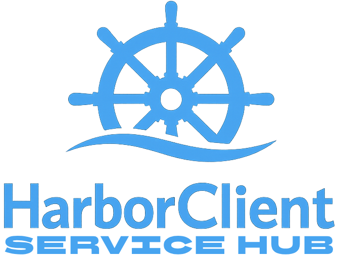

**Full documentation:** [https://headzoo.github.io/harborclient-service-hub/](https://headzoo.github.io/harborclient-service-hub/)

**Linux CLI server for shared HarborClient storage and team workflows.**

`service-hub` is the central server companion to [HarborClient](https://github.com/harborclient/harborclient):

- **CLI-first:** Run and manage the server from the `service-hub` command.
- **Fastify HTTP API:** HTTP server scaffold ready for HarborClient desktop clients.
- **Configurable storage:** YAML-based server config with MySQL database support.

## Documentation

| Topic           | Link                                                                              |
| --------------- | --------------------------------------------------------------------------------- |
| Getting started | [Introduction](https://headzoo.github.io/harborclient-service-hub/)               |
| Prerequisites   | [Prerequisites](https://headzoo.github.io/harborclient-service-hub/prerequisites) |
| Setup           | [Setup](https://headzoo.github.io/harborclient-service-hub/setup)                 |
| Development     | [Development](https://headzoo.github.io/harborclient-service-hub/development)     |

Canonical docs live in [`docs/`](./docs/). Edit those pages directly, then run `pnpm docs:build:nav` to refresh the VitePress sidebar.

## Development

```bash
pnpm install
pnpm test
pnpm docs:serve    # VitePress dev server with nav watcher
pnpm docs:build    # production docs build
```

## License

MIT
