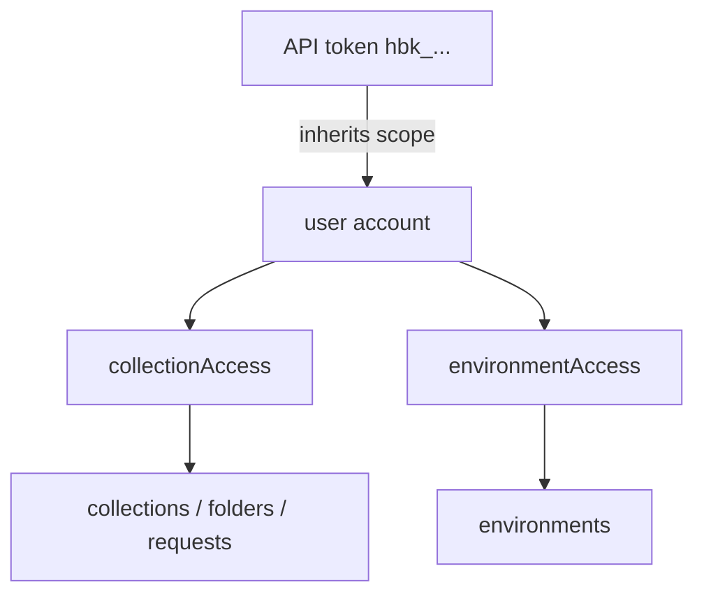

# Authentication

HarborClient Server protects API routes with database-backed bearer tokens tied to user accounts. Operators manage users and tokens via the CLI; HarborClient desktop clients authenticate with tokens issued to `user`-role accounts.

## Prerequisites

Configure your database in `server.yaml`, then apply schema migrations:

```bash
harborclient-server migrate
```

For Postgres and MySQL this creates the `users` and `api_tokens` tables (plus entity tables). Firestore uses schemaless `users` and `apiTokens` collections.

Migration also assigns any legacy tokens without an owner to a bootstrap user named `bootstrap` with full (`*`) collection and environment access. Create named users, issue new tokens, then revoke bootstrap tokens when you are ready.

## Roles and access

Every account has a role of either `user` or `admin`. Set the role when creating or updating a user via the CLI (see [Manage users](#manage-users)).

### Roles

| Role | Purpose | HTTP API | API tokens | CLI |
| ---- | ------- | -------- | ---------- | --- |
| `user` | HarborClient desktop clients | Entity routes (collections, environments, folders, requests) — see [API Endpoints](./endpoints.md) | Yes | User and token management (any operator with shell access) |
| `admin` | Operator identity without data API access | **403 Forbidden** on all entity routes | **No** — token creation rejected | User and token management (any operator with shell access) |

**`admin` accounts**

- Cannot receive bearer tokens — `user token create` fails for admin users.
- Always store empty access lists; passing `--collection-access` or `--environment-access` on create or update is rejected.
- Provide a named operator account that cannot read or mutate shared HarborClient data via the HTTP API. The system prevents token issuance for this role.

**`user` accounts**

- Intended for HarborClient desktop clients authenticating with `hbk_…` bearer tokens.
- Permissions come from the role plus access lists described in [Access](#access) below.
- User and token management has no HTTP endpoints — operators use the CLI regardless of their own account role.

### Access

Access lists scope what a `user`-role account can see and change via the API. Both fields are independent JSON arrays of UUID strings on the user record. Only `user`-role accounts use these fields; `admin` accounts always have `[]`.

**Wildcard `*`**

- `['*']` grants all resources of that type.
- The wildcard must be the only entry — the CLI rejects lists like `['*', '<uuid>']`.
- Set via `--collection-access '*'` or `--environment-access '*'`.

**What each list controls**

| Field | Governs |
| ----- | ------- |
| `collectionAccess` | Collections, and all folders and requests inside allowed collections |
| `environmentAccess` | Environments only |

**Permission matrix for `user` accounts**

| Access config | List (GET) | Create top-level resource (POST `/collections` or `/environments`) | CRUD inside allowed scope |
| ------------- | ---------- | ------------------------------------------------------------------ | ------------------------- |
| `['*']` | All | Yes | Yes |
| Specific UUIDs | Only listed ids | No (403) | Yes for listed collections/environments |
| `[]` | Empty (200, `[]`) | No | 403 on any entity operation |

Scoped users can create folders and requests **within** collections they can access. Only **new top-level** collections or environments require wildcard access on the relevant list.

**Token inheritance**

API tokens do not carry their own scope. Each token inherits the owning user's `collectionAccess` and `environmentAccess` entirely.

**HTTP outcomes**

- Invalid or missing token → **401** (see [API Endpoints — Errors](./endpoints.md#errors)).
- Valid token but wrong role or out-of-scope resource → **403** `{ "error": "Forbidden" }`.



## Manage users

Use the command line to create and manage users.

```bash
# Create an admin (CLI-only account)
harborclient-server user create --name ops --role admin

# Create a user with full access
harborclient-server user create --name alice --role user \
  --collection-access '*' --environment-access '*'

# Create a user with access to specific collections/environments
harborclient-server user create --name bob --role user \
  --collection-access <collection-id> --environment-access <environment-id>

harborclient-server user list
harborclient-server user show <user-id>
harborclient-server user update <user-id> --role user --collection-access '*'
harborclient-server user delete <user-id>
```

## Manage tokens

Tokens always belong to a user. Admin users cannot receive tokens.

```bash
harborclient-server user token create --user <user-id> --name "Alice laptop"
harborclient-server user token list
harborclient-server user token list --user <user-id>
harborclient-server user token revoke <token-id>
```

The `user token create` command prints a one-time secret prefixed with `hbk_`. Store it immediately — the server only persists a sha256 hash.

Example output:

```text
Created API token "Alice laptop" (550e8400-e29b-41d4-a716-446655440000) for user "alice".
Token prefix: hbk_AbCd1234

Store this token now; it will not be shown again:
hbk_...
```
